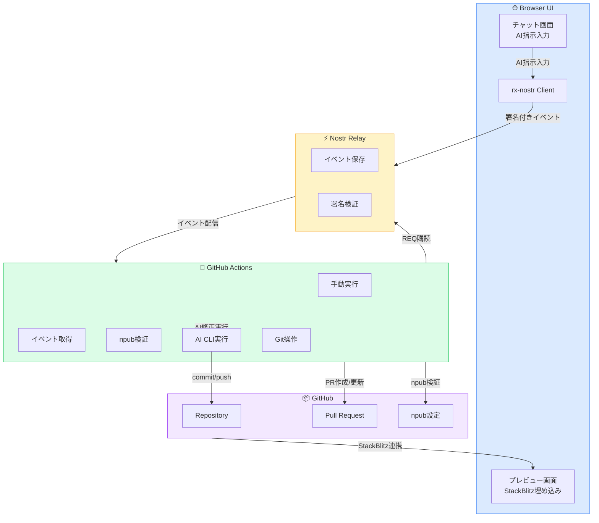
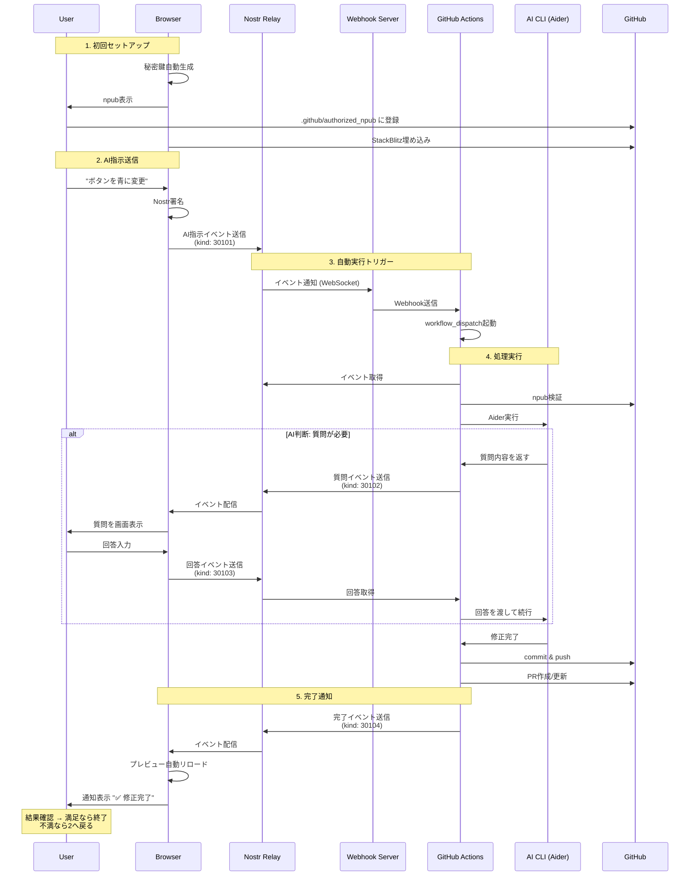
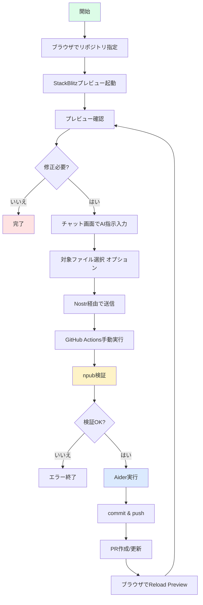

# Nostr + StackBlitz フロントエンド開発ワークフロー 設計書 v3

> **DEPRECATED**: This document describes the original Nostr + StackBlitz + GitHub Actions
> architecture (v3), which was superseded after Phase 1 (removal of Nostr/Chat features).
> The current implementation focuses on StackBlitz preview with local settings persistence.
> See [README.md](../README.md) and [ROADMAP.md](../ROADMAP.md) for current status.

## 📋 概要

GitHub上のフロントエンドリポジトリをStackBlitzでプレビューしつつ、Nostr経由でAI指示を送信し、GitHub Actionsで修正を反映する反復開発ワークフロー。

**対象ユーザー**: 基本的に個人開発者（1人）を想定  
**簡略化方針**: ブラウザ上での直接編集機能はオミット。AI指示のみで開発。

---

## 🏗️ システム構成



---

## 🔄 ワークフローシーケンス（自動化版）



---

## 🖥️ ブラウザUI設計

### モバイルファーストUI（シングルビュー切り替え）

```
【スマホ - チャット画面】
┏━━━━━━━━━━━━━━━━━━━━━━━━━━━━┓
┃ ☰  Dev with AI    💬 👁️     ┃ ← Header
┣━━━━━━━━━━━━━━━━━━━━━━━━━━━━┫
┃  ┌────────────────────────┐  ┃
┃  │ 14:32                  │  ┃
┃  │ ボタンの色を青に変更   │  ┃ ← 履歴
┃  └────────────────────────┘  ┃
┃  ⋮                           ┃
┣━━━━━━━━━━━━━━━━━━━━━━━━━━━━┫
┃ ┌──────────────────────────┐ ┃
┃ │ AI指示を入力...          │ ┃ ← 入力
┃ └──────────────────────────┘ ┃
┃     [📤 Send via Nostr]      ┃
┗━━━━━━━━━━━━━━━━━━━━━━━━━━━━┛

【スマホ - プレビュー画面】
┏━━━━━━━━━━━━━━━━━━━━━━━━━━━━┓
┃ ☰  Dev with AI    💬 👁️     ┃
┣━━━━━━━━━━━━━━━━━━━━━━━━━━━━┫
┃ owner/repo : main   🔄       ┃
┣━━━━━━━━━━━━━━━━━━━━━━━━━━━━┫
┃  ┌────────────────────────┐  ┃
┃  │   StackBlitz Preview   │  ┃ ← iframe
┃  │   [Your App Here]      │  ┃
┃  └────────────────────────┘  ┃
┃    [🔄 Reload Preview]       ┃
┗━━━━━━━━━━━━━━━━━━━━━━━━━━━━┛
```

### デスクトップ版（2カラム）

```
┌──────────────────────────────────────────────────────────┐
│ Dev with AI          owner/repo : main   [🔄 Reload]     │
├─────────────────────┬────────────────────────────────────┤
│  💬 Chat            │  👁️ Preview                        │
│  ┌───────────────┐  │  ┌──────────────────────────────┐ │
│  │ 14:32         │  │  │   StackBlitz Preview         │ │
│  │ ボタンを青に  │  │  │   [Your App Here]            │ │
│  └───────────────┘  │  └──────────────────────────────┘ │
│  ┌───────────────┐  │                                    │
│  │ AI指示...     │  │                                    │
│  └───────────────┘  │                                    │
│  [Send]             │                                    │
└─────────────────────┴────────────────────────────────────┘
```

---

## 📦 Nostrイベント定義（拡張版）

### イベント種別一覧

```
kind: 30101 - AI編集指示（ブラウザ → Actions）
kind: 30102 - AI質問（Actions → ブラウザ）
kind: 30103 - 質問回答（ブラウザ → Actions）
kind: 30104 - 処理完了通知（Actions → ブラウザ）
```

### 1. AI編集指示 (30101)

```json
{
  "kind": 30101,
  "pubkey": "user_pubkey",
  "created_at": 1234567890,
  "tags": [
    ["repo", "owner/repo"],
    ["branch", "feature/ui-update"],
    ["request_id", "req_abc123"]
  ],
  "content": "ボタンの色を青に変更してください",
  "sig": "..."
}
```

### 2. AI質問 (30102)

```json
{
  "kind": 30102,
  "pubkey": "actions_bot_pubkey",
  "created_at": 1234567891,
  "tags": [
    ["repo", "owner/repo"],
    ["branch", "feature/ui-update"],
    ["request_id", "req_abc123"],
    ["p", "user_pubkey"]
  ],
  "content": "どの青色にしますか？ (1) #0000FF (2) #4169E1 (3) #1E90FF",
  "sig": "..."
}
```

### 3. 質問回答 (30103)

```json
{
  "kind": 30103,
  "pubkey": "user_pubkey",
  "created_at": 1234567892,
  "tags": [
    ["repo", "owner/repo"],
    ["branch", "feature/ui-update"],
    ["request_id", "req_abc123"],
    ["e", "question_event_id"]
  ],
  "content": "2番の #4169E1 でお願いします",
  "sig": "..."
}
```

### 4. 処理完了通知 (30104)

```json
{
  "kind": 30104,
  "pubkey": "actions_bot_pubkey",
  "created_at": 1234567893,
  "tags": [
    ["repo", "owner/repo"],
    ["branch", "feature/ui-update"],
    ["request_id", "req_abc123"],
    ["p", "user_pubkey"],
    ["status", "success"],
    ["commit", "abc123def456"],
    ["pr_url", "https://github.com/owner/repo/pull/123"]
  ],
  "content": "✅ 修正完了しました。PR #123 を更新しました。",
  "sig": "..."
}
```

### tagsの共通ルール

- `["repo", "owner/repo"]`: 必須
- `["branch", "name"]`: 必須
- `["request_id", "id"]`: リクエスト追跡用UUID（必須）
- `["p", "pubkey"]`: 宛先ユーザー
- `["e", "event_id"]`: 返信元イベント

---

## 🏗️ リポジトリ構成（2リポジトリ方式）

### 全体像

```
┌─────────────────────────────────────┐
│ Repo 1: dev-with-ai-tool            │  ← ツール側（1回セットアップ）
│ https://github.com/user/dev-with-ai │
├─────────────────────────────────────┤
│ browser-app/                        │
│ ├── src/                            │
│ │   ├── App.svelte                  │
│ │   ├── lib/                        │
│ │   └── components/                 │
│ ├── package.json                    │
│ └── vite.config.js                  │
│                                     │
│ .github/                            │
│ ├── workflows/                      │
│ │   └── deploy.yml                  │  ← GitHub Pagesへ自動デプロイ
│ └── template/                       │
│     ├── apply-instructions.yml      │  ← テンプレート
│     └── authorized_npub.example     │
│                                     │
│ README.md                           │
└─────────────────────────────────────┘

┌─────────────────────────────────────┐
│ Repo 2: my-awesome-app              │  ← 開発対象（プロジェクトごと）
│ https://github.com/user/my-app     │
├─────────────────────────────────────┤
│ .github/                            │
│ ├── workflows/                      │
│ │   ├── apply-instructions.yml     │  ← Repo1からコピー
│ │   └── deploy.yml                 │  ← アプリのデプロイ
│ └── authorized_npub                │  ← あなたのnpub
│                                     │
│ src/                                │  ← アプリのコード
│ ├── App.svelte                      │
│ ├── components/                     │
│ └── ...                             │
│                                     │
│ package.json                        │
│ vite.config.js                      │
│ README.md                           │
└─────────────────────────────────────┘
```

---

## 📦 Repo 1: dev-with-ai-tool 詳細

### ディレクトリ構成

```
dev-with-ai-tool/
├── browser-app/
│   ├── src/
│   │   ├── App.svelte
│   │   ├── main.js
│   │   ├── lib/
│   │   │   ├── nostr.js
│   │   │   └── stackblitz.js
│   │   └── components/
│   │       ├── Header.svelte
│   │       ├── ChatView.svelte
│   │       ├── PreviewView.svelte
│   │       └── Message.svelte
│   ├── public/
│   │   └── favicon.ico
│   ├── index.html
│   ├── package.json
│   ├── vite.config.js
│   └── .gitignore
│
├── .github/
│   ├── workflows/
│   │   └── deploy-browser.yml
│   └── template/
│       ├── apply-instructions.yml
│       ├── nostr-poller.yml
│       └── authorized_npub.example
│
├── docs/
│   └── setup-guide.md
│
└── README.md
```

### browser-app/vite.config.js

```javascript
import { defineConfig } from 'vite';
import { svelte } from '@sveltejs/vite-plugin-svelte';

export default defineConfig({
  plugins: [svelte()],
  base: '/dev-with-ai-tool/', // GitHub Pages用
  build: {
    outDir: 'dist'
  }
});
```

### .github/workflows/deploy-browser.yml

```yaml
name: Deploy Browser App to GitHub Pages

on:
  push:
    branches: [main]
    paths:
      - 'browser-app/**'
  workflow_dispatch:

permissions:
  contents: read
  pages: write
  id-token: write

jobs:
  build:
    runs-on: ubuntu-latest
    steps:
      - uses: actions/checkout@v4
      
      - name: Setup Node
        uses: actions/setup-node@v4
        with:
          node-version: '20'
      
      - name: Install dependencies
        working-directory: ./browser-app
        run: npm install
      
      - name: Build
        working-directory: ./browser-app
        run: npm run build
      
      - name: Upload artifact
        uses: actions/upload-pages-artifact@v3
        with:
          path: ./browser-app/dist
  
  deploy:
    needs: build
    runs-on: ubuntu-latest
    environment:
      name: github-pages
      url: ${{ steps.deployment.outputs.page_url }}
    steps:
      - name: Deploy to GitHub Pages
        id: deployment
        uses: actions/deploy-pages@v4
```

### .github/template/apply-instructions.yml（テンプレート）

```yaml
name: Apply AI Instructions via Nostr

on:
  schedule:
    - cron: '*/2 * * * *'  # 2分ごとポーリング
  workflow_dispatch:
  repository_dispatch:
    types: [nostr_instruction]

jobs:
  apply-ai-instructions:
    runs-on: ubuntu-latest
    
    steps:
      - name: Checkout
        uses: actions/checkout@v4
        with:
          fetch-depth: 0  # 全履歴取得
      
      - name: Setup Tools
        run: |
          # Nostr CLI
          curl -L https://github.com/0xtrr/nostr-cli/releases/download/v0.1.0/nostr-cli-linux-amd64 -o /usr/local/bin/nostr-cli
          chmod +x /usr/local/bin/nostr-cli
          
          # Aider
          pip install aider-chat
        env:
          ANTHROPIC_API_KEY: ${{ secrets.ANTHROPIC_API_KEY }}
      
      - name: Fetch Nostr Events
        id: fetch
        run: |
          CACHE_FILE=.github/cache/last_processed.txt
          mkdir -p .github/cache
          LAST_TIME=$(cat $CACHE_FILE 2>/dev/null || echo 0)
          
          EVENTS=$(nostr-cli req \
            --relay wss://relay.damus.io \
            --kind 30101 \
            --tag repo=${{ github.repository }} \
            --since $LAST_TIME \
            --limit 10)
          
          echo "events=$EVENTS" >> $GITHUB_OUTPUT
          
          # イベントがなければ終了
          if [ -z "$EVENTS" ] || [ "$EVENTS" = "[]" ]; then
            echo "no_events=true" >> $GITHUB_OUTPUT
            exit 0
          fi
          echo "no_events=false" >> $GITHUB_OUTPUT
      
      - name: Verify npub
        if: steps.fetch.outputs.no_events == 'false'
        run: |
          AUTHORIZED_NPUB=$(cat .github/authorized_npub)
          EVENT_PUBKEY=$(echo '${{ steps.fetch.outputs.events }}' | jq -r '.[0].pubkey')
          
          # pubkey を npub に変換（nostr-cliの機能使用）
          EVENT_NPUB=$(nostr-cli encode npub $EVENT_PUBKEY)
          
          if [ "$EVENT_NPUB" != "$AUTHORIZED_NPUB" ]; then
            echo "❌ Unauthorized npub: $EVENT_NPUB"
            exit 1
          fi
          echo "✅ Authorized user: $EVENT_NPUB"
      
      - name: Apply AI Instructions
        if: steps.fetch.outputs.no_events == 'false'
        id: aider
        run: |
          EVENT=$(echo '${{ steps.fetch.outputs.events }}' | jq -r '.[0]')
          INSTRUCTION=$(echo $EVENT | jq -r '.content')
          BRANCH=$(echo $EVENT | jq -r '.tags[] | select(.[0]=="branch") | .[1]')
          REQUEST_ID=$(echo $EVENT | jq -r '.tags[] | select(.[0]=="request_id") | .[1]')
          
          echo "📝 Instruction: $INSTRUCTION"
          echo "🌿 Branch: $BRANCH"
          
          # ブランチ作成/切り替え
          git config user.name "AI Bot"
          git config user.email "ai@bot.local"
          git checkout -B "$BRANCH" 2>/dev/null || git checkout "$BRANCH"
          
          # Aider実行
          aider --yes --message "$INSTRUCTION"
          
          echo "request_id=$REQUEST_ID" >> $GITHUB_OUTPUT
          echo "branch=$BRANCH" >> $GITHUB_OUTPUT
      
      - name: Commit & Push
        if: steps.fetch.outputs.no_events == 'false'
        run: |
          EVENT=$(echo '${{ steps.fetch.outputs.events }}' | jq -r '.[0]')
          INSTRUCTION=$(echo $EVENT | jq -r '.content' | head -c 50)
          BRANCH=${{ steps.aider.outputs.branch }}
          
          git add .
          git commit -m "🤖 AI: $INSTRUCTION..." || echo "No changes to commit"
          git push origin "$BRANCH" --force
      
      - name: Create/Update PR
        if: steps.fetch.outputs.no_events == 'false'
        id: pr
        run: |
          EVENT=$(echo '${{ steps.fetch.outputs.events }}' | jq -r '.[0]')
          INSTRUCTION=$(echo $EVENT | jq -r '.content')
          BRANCH=${{ steps.aider.outputs.branch }}
          
          # PR作成または取得
          PR_URL=$(gh pr create \
            --title "🤖 AI修正: $INSTRUCTION" \
            --body "Nostr経由でAI指示を実行しました" \
            --base main \
            --head "$BRANCH" 2>/dev/null || \
            gh pr view "$BRANCH" --json url -q .url)
          
          echo "pr_url=$PR_URL" >> $GITHUB_OUTPUT
        env:
          GH_TOKEN: ${{ secrets.GITHUB_TOKEN }}
      
      - name: Send Completion Event
        if: steps.fetch.outputs.no_events == 'false'
        run: |
          EVENT=$(echo '${{ steps.fetch.outputs.events }}' | jq -r '.[0]')
          REQUEST_ID=${{ steps.aider.outputs.request_id }}
          USER_PUBKEY=$(echo $EVENT | jq -r '.pubkey')
          BRANCH=${{ steps.aider.outputs.branch }}
          COMMIT=$(git rev-parse HEAD)
          
          # 完了イベント送信（nostr-cliを使用）
          nostr-cli event \
            --kind 30104 \
            --tag repo=${{ github.repository }} \
            --tag branch=$BRANCH \
            --tag request_id=$REQUEST_ID \
            --tag p=$USER_PUBKEY \
            --tag status=success \
            --tag commit=$COMMIT \
            --tag pr_url=${{ steps.pr.outputs.pr_url }} \
            --content "✅ 修正完了しました" \
            --relay wss://relay.damus.io \
            --nsec ${{ secrets.ACTIONS_BOT_NSEC }}
      
      - name: Update Last Processed Time
        if: steps.fetch.outputs.no_events == 'false'
        run: |
          date +%s > .github/cache/last_processed.txt
          git add .github/cache
          git commit -m "📝 Update last processed timestamp" || true
          git push origin ${{ steps.aider.outputs.branch }} || true
```

### README.md（Repo 1用）

```markdown
# Dev with AI Tool

ブラウザ上でAI指示を送信し、GitHub Actionsで自動修正を実行するフロントエンド開発ツール。

## 🌐 ブラウザアプリ

**URL**: https://YOUR_USERNAME.github.io/dev-with-ai-tool/

## 🚀 新しいプロジェクトで使う方法

### 1. 新規リポジトリ作成

```bash
# あなたの開発対象プロジェクトを作成
mkdir my-awesome-app
cd my-awesome-app
git init
```

### 2. GitHub Actionsワークフローをコピー

```bash
# このリポジトリからテンプレートをコピー
mkdir -p .github/workflows
cp path/to/dev-with-ai-tool/.github/template/apply-instructions.yml .github/workflows/
```

### 3. npubを登録

```bash
# ブラウザアプリで生成されたnpubをコピーして保存
echo "npub1abc...xyz" > .github/authorized_npub
git add .github/
git commit -m "Add Nostr AI workflow"
git push
```

### 4. GitHub Secretsを設定

リポジトリの Settings → Secrets and variables → Actions で以下を追加：

- `ANTHROPIC_API_KEY`: Claude API Key
- `ACTIONS_BOT_NSEC`: Actions Bot用のNostr秘密鍵

### 5. ブラウザアプリで開発開始

1. https://YOUR_USERNAME.github.io/dev-with-ai-tool/ にアクセス
2. リポジトリとブランチを指定
3. AI指示を送信
4. 2分以内に自動で反映される

## 📚 詳細ドキュメント

- [セットアップガイド](./docs/setup-guide.md)
- [トラブルシューティング](./docs/troubleshooting.md)
```

---

## 📦 Repo 2: my-awesome-app 詳細

### ディレクトリ構成

```
my-awesome-app/
├── .github/
│   ├── workflows/
│   │   ├── apply-instructions.yml  ← Repo1からコピー
│   │   └── deploy.yml              ← アプリのデプロイ用
│   ├── cache/
│   │   └── last_processed.txt      ← 自動生成
│   └── authorized_npub             ← あなたのnpub
│
├── src/
│   ├── App.svelte
│   ├── main.js
│   └── components/
│       └── ...
│
├── public/
│   └── favicon.ico
│
├── index.html
├── package.json
├── vite.config.js
├── .gitignore
└── README.md
```

### .github/workflows/deploy.yml（アプリ用）

```yaml
name: Deploy App to GitHub Pages

on:
  push:
    branches: [main]
  workflow_dispatch:

permissions:
  contents: read
  pages: write
  id-token: write

jobs:
  build-deploy:
    runs-on: ubuntu-latest
    steps:
      - uses: actions/checkout@v4
      
      - uses: actions/setup-node@v4
        with:
          node-version: '20'
      
      - run: npm install
      - run: npm run build
      
      - uses: actions/upload-pages-artifact@v3
        with:
          path: ./dist
      
      - uses: actions/deploy-pages@v4
```

### vite.config.js

```javascript
import { defineConfig } from 'vite';
import { svelte } from '@sveltejs/vite-plugin-svelte';

export default defineConfig({
  plugins: [svelte()],
  base: '/my-awesome-app/', // リポジトリ名に合わせる
  build: {
    outDir: 'dist'
  }
});
```

### README.md（Repo 2用）

```markdown
# My Awesome App

AI支援で開発されたアプリケーション。

## 🌐 デモ

https://YOUR_USERNAME.github.io/my-awesome-app/

## 🤖 AI開発ツールで開発中

このプロジェクトは [dev-with-ai-tool](https://github.com/YOUR_USERNAME/dev-with-ai-tool) を使用して開発されています。

## 📝 開発方法

1. [ブラウザツール](https://YOUR_USERNAME.github.io/dev-with-ai-tool/) にアクセス
2. このリポジトリを指定
3. AI指示を送信
4. 自動でPRが作成される

## 🚀 デプロイ

mainブランチにpushすると自動的にGitHub Pagesにデプロイされます。
```

---

## 🎯 セットアップフロー（全体）

### 初回セットアップ（1回のみ）

1. **Repo 1をセットアップ**
   ```bash
   git clone https://github.com/YOUR_USERNAME/dev-with-ai-tool
   cd dev-with-ai-tool/browser-app
   npm install
   npm run dev  # ローカルテスト
   git push     # GitHub Pagesに自動デプロイ
   ```

2. **Actions Bot用のNostr鍵を生成**
   ```bash
   # nostr-cliで生成
   nostr-cli generate
   # → nsec1... をコピー
   ```

### 新しいプロジェクトごと

1. **プロジェクトリポジトリ作成**
   ```bash
   mkdir my-app && cd my-app
   npm create vite@latest . -- --template svelte
   ```

2. **ワークフローをコピー**
   ```bash
   mkdir -p .github/workflows
   cp ../dev-with-ai-tool/.github/template/apply-instructions.yml .github/workflows/
   ```

3. **Secretsを設定**（GitHubのWeb UIで）
   - `ANTHROPIC_API_KEY`
   - `ACTIONS_BOT_NSEC`

4. **npubを登録**
   ```bash
   # ブラウザアプリで表示されたnpubをコピー
   echo "npub1..." > .github/authorized_npub
   git add . && git commit -m "Initial commit" && git push
   ```

5. **開発開始**
   - ブラウザツールでこのリポジトリを指定
   - AI指示を送信

---

## 🔄 デプロイURL一覧

```
ツール側:
https://YOUR_USERNAME.github.io/dev-with-ai-tool/

アプリ側:
https://YOUR_USERNAME.github.io/my-app-1/
https://YOUR_USERNAME.github.io/my-app-2/
...
```

すべて独立してGitHub Pagesで動作！

#### src/lib/nostr.js

```javascript
import { createRxNostr, createRxForwardReq, uniq } from 'rx-nostr';
import { generateSecretKey, getPublicKey, finalizeEvent } from 'nostr-tools';
import { nip19 } from 'nostr-tools';

const RELAY_URL = 'wss://relay.damus.io';

export class NostrClient {
  constructor() {
    this.rxNostr = createRxNostr();
    this.sk = null;
    this.npub = '';
    this.onMessageCallbacks = [];
  }

  async init() {
    // 秘密鍵の初期化
    const storedSk = localStorage.getItem('nostr_sk');
    if (storedSk) {
      this.sk = new Uint8Array(JSON.parse(storedSk));
    } else if (window.nostr) {
      // NIP-07対応
      const pk = await window.nostr.getPublicKey();
      this.npub = nip19.npubEncode(pk);
      return;
    } else {
      // 新規生成
      this.sk = generateSecretKey();
      localStorage.setItem('nostr_sk', JSON.stringify(Array.from(this.sk)));
    }

    const pk = getPublicKey(this.sk);
    this.npub = nip19.npubEncode(pk);

    // リレー接続
    await this.rxNostr.setRelays([RELAY_URL]);
  }

  subscribe() {
    const pk = this.sk ? getPublicKey(this.sk) : null;
    if (!pk && !window.nostr) return;

    const sub = this.rxNostr.use(createRxForwardReq()).pipe(uniq());

    sub.subscribe({
      filters: [
        { kinds: [30102, 30104], '#p': [pk] }
      ]
    }).subscribe((packet) => {
      this.onMessageCallbacks.forEach(cb => cb(packet.event));
    });
  }

  onMessage(callback) {
    this.onMessageCallbacks.push(callback);
  }

  async sendInstruction(repo, branch, instruction, requestId) {
    const event = {
      kind: 30101,
      created_at: Math.floor(Date.now() / 1000),
      tags: [
        ['repo', repo],
        ['branch', branch],
        ['request_id', requestId]
      ],
      content: instruction
    };

    const signedEvent = await this.signEvent(event);
    await this.rxNostr.send(signedEvent);
  }

  async sendAnswer(repo, branch, requestId, questionEventId, answer) {
    const event = {
      kind: 30103,
      created_at: Math.floor(Date.now() / 1000),
      tags: [
        ['repo', repo],
        ['branch', branch],
        ['request_id', requestId],
        ['e', questionEventId]
      ],
      content: answer
    };

    const signedEvent = await this.signEvent(event);
    await this.rxNostr.send(signedEvent);
  }

  async signEvent(event) {
    if (window.nostr && !this.sk) {
      return await window.nostr.signEvent(event);
    } else {
      return finalizeEvent(event, this.sk);
    }
  }

  getNpub() {
    return this.npub;
  }
}
```

#### src/lib/stackblitz.js

```javascript
import sdk from '@stackblitz/sdk';

export class StackBlitzManager {
  constructor(containerId) {
    this.containerId = containerId;
    this.vm = null;
  }

  async embedProject(repo, branch) {
    this.vm = await sdk.embedGithubProject(
      this.containerId,
      repo,
      {
        forceEmbedLayout: true,
        view: 'preview',
        height: '100%',
        gitBranch: branch,
        theme: 'light'
      }
    );
    return this.vm;
  }

  async reload(repo, branch) {
    // 既存のVMを破棄して再作成
    if (this.vm) {
      // StackBlitzには明示的な破棄メソッドがないため、コンテナをクリア
      const container = document.getElementById(this.containerId);
      container.innerHTML = '';
    }
    return await this.embedProject(repo, branch);
  }
}
```

#### src/components/Header.svelte

```svelte
<script>
  export let npub = '';
  export let activeView = 'chat';
  export let onViewChange;
  
  let menuOpen = false;
  
  $: shortNpub = npub ? npub.slice(0, 12) + '...' : 'Loading...';
</script>

<header>
  <div class="header-content">
    <button class="menu-btn" on:click={() => menuOpen = !menuOpen}>
      {#if menuOpen}
        ✕
      {:else}
        ☰
      {/if}
    </button>
    
    <h1>Dev with AI</h1>
    
    <div class="view-toggle">
      <button 
        class:active={activeView === 'chat'}
        on:click={() => onViewChange('chat')}
        aria-label="Chat view"
      >
        💬
      </button>
      <button 
        class:active={activeView === 'preview'}
        on:click={() => onViewChange('preview')}
        aria-label="Preview view"
      >
        👁️
      </button>
    </div>
  </div>
  
  {#if menuOpen}
    <div class="menu">
      <div class="menu-item">
        <label>Your npub:</label>
        <div class="npub-display">
          {shortNpub}
          <button on:click={() => navigator.clipboard.writeText(npub)}>
            📋
          </button>
        </div>
        <p class="help-text">
          このnpubを .github/authorized_npub に登録してください
        </p>
      </div>
    </div>
  {/if}
</header>

<style>
  header {
    background: #3b82f6;
    color: white;
    box-shadow: 0 2px 4px rgba(0,0,0,0.1);
  }
  
  .header-content {
    display: flex;
    align-items: center;
    justify-content: space-between;
    padding: 1rem;
  }
  
  h1 {
    font-size: 1.25rem;
    margin: 0;
    font-weight: 700;
  }
  
  .menu-btn {
    background: transparent;
    border: none;
    color: white;
    font-size: 1.5rem;
    cursor: pointer;
    padding: 0.5rem;
    display: flex;
    align-items: center;
    justify-content: center;
  }
  
  .view-toggle {
    display: flex;
    gap: 0.5rem;
  }
  
  .view-toggle button {
    background: rgba(255,255,255,0.1);
    border: none;
    color: white;
    font-size: 1.25rem;
    padding: 0.5rem 0.75rem;
    border-radius: 0.5rem;
    cursor: pointer;
    transition: background 0.2s;
  }
  
  .view-toggle button.active {
    background: rgba(255,255,255,0.3);
  }
  
  .menu {
    background: #2563eb;
    padding: 1rem;
    border-top: 1px solid rgba(255,255,255,0.1);
  }
  
  .menu-item {
    margin-bottom: 1rem;
  }
  
  .menu-item label {
    display: block;
    font-size: 0.875rem;
    margin-bottom: 0.5rem;
    opacity: 0.9;
  }
  
  .npub-display {
    display: flex;
    align-items: center;
    gap: 0.5rem;
    background: rgba(255,255,255,0.1);
    padding: 0.75rem;
    border-radius: 0.5rem;
    font-family: monospace;
    font-size: 0.875rem;
  }
  
  .npub-display button {
    background: rgba(255,255,255,0.2);
    border: none;
    color: white;
    padding: 0.25rem 0.5rem;
    border-radius: 0.25rem;
    cursor: pointer;
  }
  
  .help-text {
    margin-top: 0.5rem;
    font-size: 0.75rem;
    opacity: 0.8;
    line-height: 1.4;
  }
</style>
```

#### src/components/Message.svelte

```svelte
<script>
  export let message;
  export let onAnswer = null;
  
  let answerText = '';
  
  function handleAnswer() {
    if (answerText.trim() && onAnswer) {
      onAnswer(message.eventId, answerText);
      answerText = '';
    }
  }
</script>

<div class="message {message.type}">
  <div class="time">{message.time}</div>
  <div class="content">{message.content}</div>
  
  {#if message.type === 'question'}
    <div class="answer-input">
      <input 
        type="text" 
        bind:value={answerText}
        placeholder="回答を入力..."
        on:keydown={(e) => e.key === 'Enter' && handleAnswer()}
      />
      <button on:click={handleAnswer}>送信</button>
    </div>
  {/if}
  
  {#if message.type === 'completion'}
    <div class="status {message.status}">
      {#if message.status === 'success'}
        ✅ 成功
      {:else if message.status === 'error'}
        ❌ エラー
      {:else}
        ⏳ 処理中
      {/if}
    </div>
    
    {#if message.prUrl}
      <a href={message.prUrl} target="_blank" rel="noopener">
        📎 PRを見る
      </a>
    {/if}
  {/if}
</div>

<style>
  .message {
    background: white;
    padding: 1rem;
    margin-bottom: 0.75rem;
    border-radius: 0.75rem;
    box-shadow: 0 1px 3px rgba(0,0,0,0.1);
  }
  
  .message.instruction {
    background: #dbeafe;
  }
  
  .message.question {
    background: #fef3c7;
    border-left: 4px solid #f59e0b;
  }
  
  .message.completion {
    background: #dcfce7;
    border-left: 4px solid #22c55e;
  }
  
  .time {
    font-size: 0.75rem;
    color: #6b7280;
    margin-bottom: 0.5rem;
  }
  
  .content {
    color: #1f2937;
    line-height: 1.5;
    white-space: pre-wrap;
  }
  
  .answer-input {
    display: flex;
    gap: 0.5rem;
    margin-top: 0.75rem;
  }
  
  .answer-input input {
    flex: 1;
    padding: 0.5rem;
    border: 1px solid #d1d5db;
    border-radius: 0.5rem;
    font-size: 0.875rem;
  }
  
  .answer-input button {
    padding: 0.5rem 1rem;
    background: #f59e0b;
    color: white;
    border: none;
    border-radius: 0.5rem;
    font-size: 0.875rem;
    cursor: pointer;
  }
  
  .status {
    display: inline-block;
    margin-top: 0.5rem;
    padding: 0.25rem 0.75rem;
    border-radius: 0.25rem;
    font-size: 0.875rem;
    font-weight: 500;
  }
  
  .status.success {
    background: #d1fae5;
    color: #065f46;
  }
  
  .status.error {
    background: #fee2e2;
    color: #991b1b;
  }
  
  a {
    display: inline-block;
    margin-top: 0.5rem;
    color: #2563eb;
    text-decoration: none;
    font-size: 0.875rem;
  }
</style>
```

#### src/components/ChatView.svelte

```svelte
<script>
  import Message from './Message.svelte';
  
  export let messages = [];
  export let instruction = '';
  export let onSend;
  export let onAnswer;
  
  let messagesContainer;
  
  $: if (messagesContainer) {
    messagesContainer.scrollTop = messagesContainer.scrollHeight;
  }
  
  function handleSend() {
    if (instruction.trim()) {
      onSend(instruction);
    }
  }
</script>

<div class="chat-view">
  <div class="messages" bind:this={messagesContainer}>
    {#if messages.length === 0}
      <div class="empty-state">
        <p>💬 AI指示を入力して送信してください</p>
        <p class="help">例: ボタンの色を青に変更してください</p>
      </div>
    {:else}
      {#each messages as message (message.id || message.time)}
        <Message {message} onAnswer={onAnswer} />
      {/each}
    {/if}
  </div>
  
  <div class="input-area">
    <textarea
      bind:value={instruction}
      placeholder="AI指示を入力...&#10;&#10;例: ボタンの色を青に変更してください"
      rows="3"
      on:keydown={(e) => {
        if (e.key === 'Enter' && (e.metaKey || e.ctrlKey)) {
          handleSend();
        }
      }}
    />
    <button 
      on:click={handleSend}
      disabled={!instruction.trim()}
    >
      📤 Send via Nostr
    </button>
    <p class="hint">⌘+Enter または Ctrl+Enter で送信</p>
  </div>
</div>

<style>
  .chat-view {
    display: flex;
    flex-direction: column;
    height: 100%;
    background: #f9fafb;
  }
  
  .messages {
    flex: 1;
    overflow-y: auto;
    padding: 1rem;
  }
  
  .empty-state {
    display: flex;
    flex-direction: column;
    align-items: center;
    justify-content: center;
    height: 100%;
    color: #6b7280;
    text-align: center;
    padding: 2rem;
  }
  
  .empty-state p {
    margin: 0.5rem 0;
  }
  
  .empty-state .help {
    font-size: 0.875rem;
    opacity: 0.7;
  }
  
  .input-area {
    padding: 1rem;
    background: white;
    border-top: 1px solid #e5e7eb;
  }
  
  textarea {
    width: 100%;
    padding: 0.75rem;
    border: 1px solid #d1d5db;
    border-radius: 0.5rem;
    font-family: inherit;
    font-size: 1rem;
    resize: none;
    margin-bottom: 0.75rem;
  }
  
  textarea:focus {
    outline: none;
    border-color: #3b82f6;
    box-shadow: 0 0 0 3px rgba(59, 130, 246, 0.1);
  }
  
  button {
    width: 100%;
    padding: 0.75rem;
    background: #3b82f6;
    color: white;
    border: none;
    border-radius: 0.5rem;
    font-size: 1rem;
    font-weight: 500;
    cursor: pointer;
    transition: background 0.2s;
  }
  
  button:hover:not(:disabled) {
    background: #2563eb;
  }
  
  button:disabled {
    background: #9ca3af;
    cursor: not-allowed;
  }
  
  .hint {
    margin-top: 0.5rem;
    font-size: 0.75rem;
    color: #6b7280;
    text-align: center;
  }
</style>
```

#### src/components/PreviewView.svelte

```svelte
<script>
  import { onMount } from 'svelte';
  
  export let repo = '';
  export let branch = '';
  export let onLoad;
  export let onReload;
  
  let loading = false;
  
  async function handleLoad() {
    loading = true;
    await onLoad();
    loading = false;
  }
  
  async function handleReload() {
    loading = true;
    await onReload();
    loading = false;
  }
</script>

<div class="preview-view">
  <div class="controls">
    <div class="input-group">
      <label>Repository</label>
      <input 
        type="text"
        bind:value={repo}
        placeholder="owner/repo"
      />
    </div>
    
    <div class="input-group">
      <label>Branch</label>
      <input 
        type="text"
        bind:value={branch}
        placeholder="main"
      />
    </div>
    
    <div class="button-group">
      <button on:click={handleLoad} disabled={loading || !repo}>
        {#if loading}
          ⏳ Loading...
        {:else}
          🚀 Load Preview
        {/if}
      </button>
      <button on:click={handleReload} disabled={loading}>
        🔄 Reload
      </button>
    </div>
  </div>
  
  <div class="preview-container">
    <div id="preview-container"></div>
  </div>
</div>

<style>
  .preview-view {
    display: flex;
    flex-direction: column;
    height: 100%;
    background: white;
  }
  
  .controls {
    padding: 1rem;
    border-bottom: 1px solid #e5e7eb;
    background: #f9fafb;
  }
  
  .input-group {
    margin-bottom: 0.75rem;
  }
  
  .input-group label {
    display: block;
    font-size: 0.875rem;
    font-weight: 500;
    color: #374151;
    margin-bottom: 0.25rem;
  }
  
  .input-group input {
    width: 100%;
    padding: 0.5rem;
    border: 1px solid #d1d5db;
    border-radius: 0.5rem;
    font-size: 0.875rem;
  }
  
  .button-group {
    display: grid;
    grid-template-columns: 1fr 1fr;
    gap: 0.5rem;
  }
  
  button {
    padding: 0.75rem;
    background: #3b82f6;
    color: white;
    border: none;
    border-radius: 0.5rem;
    font-size: 0.875rem;
    font-weight: 500;
    cursor: pointer;
    transition: background 0.2s;
  }
  
  button:hover:not(:disabled) {
    background: #2563eb;
  }
  
  button:disabled {
    background: #9ca3af;
    cursor: not-allowed;
  }
  
  .preview-container {
    flex: 1;
    overflow: hidden;
    position: relative;
  }
  
  #preview-container {
    width: 100%;
    height: 100%;
  }
</style>
```

#### src/App.svelte

```svelte
<script>
  import { onMount } from 'svelte';
  import { v4 as uuidv4 } from 'uuid';
  import Header from './components/Header.svelte';
  import ChatView from './components/ChatView.svelte';
  import PreviewView from './components/PreviewView.svelte';
  import { NostrClient } from './lib/nostr';
  import { StackBlitzManager } from './lib/stackblitz';
  
  let activeView = 'chat';
  let repo = 'facebook/react';
  let branch = 'main';
  let instruction = '';
  let messages = [];
  let npub = '';
  let currentRequestId = null;
  
  let nostrClient;
  let stackblitz;
  
  onMount(async () => {
    // Nostr初期化
    nostrClient = new NostrClient();
    await nostrClient.init();
    npub = nostrClient.getNpub();
    
    // イベント購読
    nostrClient.onMessage((event) => {
      if (event.kind === 30102) {
        // AI質問
        messages = [...messages, {
          id: event.id,
          type: 'question',
          content: event.content,
          eventId: event.id,
          time: new Date().toLocaleTimeString('ja-JP', {
            hour: '2-digit',
            minute: '2-digit'
          })
        }];
      } else if (event.kind === 30104) {
        // 完了通知
        const status = event.tags.find(t => t[0] === 'status')?.[1];
        const prUrl = event.tags.find(t => t[0] === 'pr_url')?.[1];
        
        messages = [...messages, {
          id: event.id,
          type: 'completion',
          content: event.content,
          status,
          prUrl,
          time: new Date().toLocaleTimeString('ja-JP', {
            hour: '2-digit',
            minute: '2-digit'
          })
        }];
        
        // 自動リロード
        if (status === 'success' && stackblitz) {
          setTimeout(() => handleReload(), 2000);
        }
      }
    });
    
    nostrClient.subscribe();
    
    // StackBlitz初期化
    stackblitz = new StackBlitzManager('preview-container');
  });
  
  async function handleSendInstruction(inst) {
    const requestId = uuidv4();
    currentRequestId = requestId;
    
    await nostrClient.sendInstruction(repo, branch, inst, requestId);
    
    messages = [...messages, {
      id: requestId,
      type: 'instruction',
      content: inst,
      time: new Date().toLocaleTimeString('ja-JP', {
        hour: '2-digit',
        minute: '2-digit'
      })
    }];
    
    instruction = '';
  }
  
  async function handleAnswer(questionEventId, answer) {
    await nostrClient.sendAnswer(repo, branch, currentRequestId, questionEventId, answer);
    
    messages = [...messages, {
      id: uuidv4(),
      type: 'answer',
      content: answer,
      time: new Date().toLocaleTimeString('ja-JP', {
        hour: '2-digit',
        minute: '2-digit'
      })
    }];
  }
  
  async function handleLoad() {
    if (!repo) return;
    await stackblitz.embedProject(repo, branch);
  }
  
  async function handleReload() {
    await stackblitz.reload(repo, branch);
  }
  
  function handleViewChange(view) {
    activeView = view;
  }
</script>

<div class="app">
  <Header 
    {npub} 
    {activeView}
    onViewChange={handleViewChange}
  />
  
  {#if activeView === 'chat'}
    <ChatView 
      {messages}
      bind:instruction
      onSend={handleSendInstruction}
      onAnswer={handleAnswer}
    />
  {:else}
    <PreviewView 
      bind:repo
      bind:branch
      onLoad={handleLoad}
      onReload={handleReload}
    />
  {/if}
</div>

<style>
  :global(body) {
    margin: 0;
    padding: 0;
    font-family: -apple-system, BlinkMacSystemFont, 'Segoe UI', 'Roboto', 'Oxygen',
      'Ubuntu', 'Cantarell', 'Fira Sans', 'Droid Sans', 'Helvetica Neue',
      sans-serif;
    -webkit-font-smoothing: antialiased;
    -moz-osx-font-smoothing: grayscale;
  }
  
  .app {
    display: flex;
    flex-direction: column;
    height: 100vh;
    overflow: hidden;
  }
</style>
```

#### package.json

```json
{
  "name": "dev-with-ai",
  "private": true,
  "version": "0.0.1",
  "type": "module",
  "scripts": {
    "dev": "vite",
    "build": "vite build",
    "preview": "vite preview"
  },
  "devDependencies": {
    "@sveltejs/vite-plugin-svelte": "^3.0.0",
    "svelte": "^4.2.0",
    "vite": "^5.0.0"
  },
  "dependencies": {
    "@stackblitz/sdk": "^1.9.0",
    "nostr-tools": "^2.1.0",
    "rx-nostr": "^2.0.0",
    "uuid": "^9.0.0"
  }
}
```

```typescript
import { useState, useEffect } from 'react';
import sdk from '@stackblitz/sdk';
import { createRxNostr, createRxForwardReq, uniq } from 'rx-nostr';
import { generateSecretKey, getPublicKey, finalizeEvent } from 'nostr-tools';
import { nip19 } from 'nostr-tools';
import { v4 as uuidv4 } from 'uuid';

function DevApp() {
  const [repo, setRepo] = useState('owner/repo');
  const [branch, setBranch] = useState('main');
  const [instruction, setInstruction] = useState('');
  const [sk, setSk] = useState(null);
  const [npub, setNpub] = useState('');
  const [vm, setVm] = useState(null);
  const [messages, setMessages] = useState([]);
  const [currentRequestId, setCurrentRequestId] = useState(null);

  // Nostr初期化
  const rxNostr = createRxNostr();
  
  useEffect(() => {
    // 秘密鍵の初期化（自動生成 or NIP-07）
    const storedSk = localStorage.getItem('nostr_sk');
    if (storedSk) {
      const skArray = JSON.parse(storedSk);
      setSk(skArray);
      const pk = getPublicKey(skArray);
      setNpub(nip19.npubEncode(pk));
    } else if (window.nostr) {
      // NIP-07が利用可能
      window.nostr.getPublicKey().then(pk => {
        setNpub(nip19.npubEncode(pk));
      });
    } else {
      // 自動生成
      const newSk = generateSecretKey();
      localStorage.setItem('nostr_sk', JSON.stringify(Array.from(newSk)));
      setSk(newSk);
      const pk = getPublicKey(newSk);
      setNpub(nip19.npubEncode(pk));
    }

    // Nostrリレー接続
    rxNostr.setRelays(['wss://relay.damus.io']);
    
    // イベント購読開始
    subscribeToEvents();
  }, []);

  // イベント購読（質問・完了通知）
  function subscribeToEvents() {
    const pk = sk ? getPublicKey(sk) : null;
    if (!pk && !window.nostr) return;

    const sub = rxNostr.use(createRxForwardReq()).pipe(
      uniq()
    );

    sub.subscribe({
      filters: [
        { kinds: [30102, 30104], '#p': [pk] } // 質問 & 完了通知
      ]
    }).subscribe((packet) => {
      const event = packet.event;
      
      if (event.kind === 30102) {
        // AI質問
        setMessages(prev => [...prev, {
          type: 'question',
          content: event.content,
          eventId: event.id,
          time: new Date().toLocaleTimeString()
        }]);
      } else if (event.kind === 30104) {
        // 完了通知
        const status = event.tags.find(t => t[0] === 'status')?.[1];
        const prUrl = event.tags.find(t => t[0] === 'pr_url')?.[1];
        
        setMessages(prev => [...prev, {
          type: 'completion',
          content: event.content,
          status,
          prUrl,
          time: new Date().toLocaleTimeString()
        }]);
        
        // プレビュー自動リロード
        if (status === 'success' && vm) {
          setTimeout(() => reloadPreview(), 2000);
        }
      }
    });
  }

  // StackBlitz埋め込み
  async function embedPreview() {
    const stackblitzVm = await sdk.embedGithubProject(
      'preview-container',
      repo,
      {
        forceEmbedLayout: true,
        view: 'preview',
        height: '100%',
        gitBranch: branch
      }
    );
    setVm(stackblitzVm);
  }

  // プレビュー再読み込み
  async function reloadPreview() {
    await embedPreview();
  }

  // AI指示送信
  async function sendInstruction() {
    const requestId = uuidv4();
    setCurrentRequestId(requestId);

    const event = {
      kind: 30101,
      created_at: Math.floor(Date.now() / 1000),
      tags: [
        ['repo', repo],
        ['branch', branch],
        ['request_id', requestId]
      ],
      content: instruction
    };
    
    let signedEvent;
    if (window.nostr && !sk) {
      // NIP-07で署名
      signedEvent = await window.nostr.signEvent(event);
    } else {
      // 自動生成した鍵で署名
      signedEvent = finalizeEvent(event, sk);
    }
    
    // 送信
    await rxNostr.send(signedEvent);
    
    setMessages(prev => [...prev, {
      type: 'instruction',
      content: instruction,
      time: new Date().toLocaleTimeString()
    }]);
    
    setInstruction('');
  }

  // 質問への回答
  async function sendAnswer(questionEventId, answer) {
    const event = {
      kind: 30103,
      created_at: Math.floor(Date.now() / 1000),
      tags: [
        ['repo', repo],
        ['branch', branch],
        ['request_id', currentRequestId],
        ['e', questionEventId]
      ],
      content: answer
    };
    
    let signedEvent;
    if (window.nostr && !sk) {
      signedEvent = await window.nostr.signEvent(event);
    } else {
      signedEvent = finalizeEvent(event, sk);
    }
    
    await rxNostr.send(signedEvent);
  }

  return (
    <div className="app">
      {/* UI実装（前述のアスキーアート参照） */}
      <div className="header">
        <h1>Dev with AI</h1>
        <div>npub: {npub.slice(0, 20)}...</div>
      </div>
      
      <div className="chat">
        {messages.map((msg, idx) => (
          <div key={idx} className={`message ${msg.type}`}>
            <div className="time">{msg.time}</div>
            <div className="content">{msg.content}</div>
            
            {msg.type === 'question' && (
              <input 
                type="text" 
                placeholder="回答を入力..."
                onKeyDown={(e) => {
                  if (e.key === 'Enter') {
                    sendAnswer(msg.eventId, e.target.value);
                  }
                }}
              />
            )}
            
            {msg.type === 'completion' && msg.prUrl && (
              <a href={msg.prUrl} target="_blank">PR を見る</a>
            )}
          </div>
        ))}
      </div>
      
      <div className="input-area">
        <textarea 
          value={instruction}
          onChange={(e) => setInstruction(e.target.value)}
          placeholder="AI指示を入力..."
        />
        <button onClick={sendInstruction}>Send via Nostr</button>
      </div>
      
      <div className="preview">
        <div id="preview-container"></div>
        <button onClick={reloadPreview}>🔄 Reload</button>
      </div>
    </div>
  );
}
```

---

## 🔗 Webhook自動化サーバー

### 最小構成（Cloudflare Workers推奨）

```javascript
// Cloudflare Workers で実装
import { createRxNostr, createRxForwardReq } from 'rx-nostr';

export default {
  async fetch(request, env) {
    // WebSocket接続を維持してNostrイベントを監視
    const rxNostr = createRxNostr();
    await rxNostr.setRelays(['wss://relay.damus.io']);
    
    // kind: 30101 のイベントを購読
    const sub = rxNostr.use(createRxForwardReq()).pipe(
      filters: [{ kinds: [30101], "#repo": [env.TARGET_REPO] }]
    );
    
    sub.subscribe(async (packet) => {
      const event = packet.event;
      
      // GitHub Actions Webhook送信
      const response = await fetch(
        `https://api.github.com/repos/${env.TARGET_REPO}/dispatches`,
        {
          method: 'POST',
          headers: {
            'Authorization': `Bearer ${env.GITHUB_TOKEN}`,
            'Content-Type': 'application/json'
          },
          body: JSON.stringify({
            event_type: 'nostr_instruction',
            client_payload: {
              event_id: event.id,
              timestamp: event.created_at
            }
          })
        }
      );
    });
    
    return new Response('Webhook server running');
  }
}
```

### デプロイ方法

```bash
# Cloudflare Workers
npm create cloudflare@latest nostr-webhook
cd nostr-webhook
npm install rx-nostr

# 環境変数設定
wrangler secret put GITHUB_TOKEN
wrangler secret put TARGET_REPO  # "owner/repo"

# デプロイ
wrangler deploy
```

### 代替案: GitHub Actionsでポーリング（シンプル）

```yaml
# .github/workflows/nostr-poller.yml
name: Nostr Event Poller

on:
  schedule:
    - cron: '*/2 * * * *'  # 2分ごと

jobs:
  check-events:
    runs-on: ubuntu-latest
    steps:
      - name: Check for new Nostr events
        run: |
          # 最後に処理したタイムスタンプを取得
          LAST_CHECK=$(cat .github/cache/last_check.txt || echo 0)
          
          # Nostrイベント取得
          EVENTS=$(nostr-cli req \
            --relay wss://relay.damus.io \
            --kind 30101 \
            --tag repo=${{ github.repository }} \
            --since $LAST_CHECK)
          
          # 新しいイベントがあれば処理workflow実行
          if [ ! -z "$EVENTS" ]; then
            gh workflow run apply-instructions.yml
            date +%s > .github/cache/last_check.txt
          fi
```

**推奨**: 初期はポーリング方式（シンプル）、後からWebhook化

### GitHub Actions (apply-instructions.yml)

```yaml
name: Apply AI Instructions via Nostr

on:
  workflow_dispatch:
  repository_dispatch:
    types: [nostr_instruction]
  schedule:
    - cron: '*/2 * * * *'  # 2分ごとのポーリング（Webhook代替）

jobs:
  apply-ai-instructions:
    runs-on: ubuntu-latest
    
    steps:
      - name: Checkout
        uses: actions/checkout@v4
      
      - name: Setup Tools
        run: |
          # Nostr CLI
          cargo install nostr-cli
          
          # Aider
          pip install aider-chat
        env:
          ANTHROPIC_API_KEY: ${{ secrets.ANTHROPIC_API_KEY }}
      
      - name: Fetch Nostr Events
        id: fetch
        run: |
          # 最後に処理したタイムスタンプ
          CACHE_FILE=.github/cache/last_processed.txt
          LAST_TIME=$(cat $CACHE_FILE 2>/dev/null || echo 0)
          
          # イベント取得
          EVENTS=$(nostr-cli req \
            --relay wss://relay.damus.io \
            --kind 30101 \
            --tag repo=${{ github.repository }} \
            --since $LAST_TIME \
            --limit 10)
          
          echo "events=$EVENTS" >> $GITHUB_OUTPUT
          
          # イベントがなければ終了
          if [ -z "$EVENTS" ] || [ "$EVENTS" = "[]" ]; then
            echo "No new events"
            exit 0
          fi
      
      - name: Verify npub
        run: |
          AUTHORIZED_NPUB=$(cat .github/authorized_npub)
          EVENT_PUBKEY=$(echo '${{ steps.fetch.outputs.events }}' | jq -r '.[0].pubkey')
          EVENT_NPUB=$(nostr-cli pubkey-to-npub $EVENT_PUBKEY)
          
          if [ "$EVENT_NPUB" != "$AUTHORIZED_NPUB" ]; then
            echo "❌ Unauthorized npub"
            exit 1
          fi
      
      - name: Apply AI Instructions with Interactive Q&A
        id: aider
        run: |
          EVENT=$(echo '${{ steps.fetch.outputs.events }}' | jq -r '.[0]')
          INSTRUCTION=$(echo $EVENT | jq -r '.content')
          BRANCH=$(echo $EVENT | jq -r '.tags[] | select(.[0]=="branch") | .[1]')
          REQUEST_ID=$(echo $EVENT | jq -r '.tags[] | select(.[0]=="request_id") | .[1]')
          USER_PUBKEY=$(echo $EVENT | jq -r '.pubkey')
          
          # ブランチ切り替え
          git checkout -B "$BRANCH" || git checkout "$BRANCH"
          
          # Aiderを対話モードで実行
          # 標準出力をキャプチャしてAIの質問を検出
          aider --yes --message "$INSTRUCTION" > aider_output.txt 2>&1 &
          AIDER_PID=$!
          
          # Aiderの出力を監視
          tail -f aider_output.txt | while read line; do
            # AIが質問した場合の検出（例: "?" で終わる行）
            if echo "$line" | grep -q "?$"; then
              # Nostrで質問イベント送信
              QUESTION_EVENT=$(nostr-cli event \
                --kind 30102 \
                --tag repo=${{ github.repository }} \
                --tag branch=$BRANCH \
                --tag request_id=$REQUEST_ID \
                --tag p=$USER_PUBKEY \
                --content "$line" \
                --relay wss://relay.damus.io \
                --sign-with ${{ secrets.ACTIONS_BOT_NSEC }})
              
              # ユーザーの回答を待つ（30秒タイムアウト）
              TIMEOUT=30
              while [ $TIMEOUT -gt 0 ]; do
                ANSWER=$(nostr-cli req \
                  --relay wss://relay.damus.io \
                  --kind 30103 \
                  --tag request_id=$REQUEST_ID \
                  --since $(date +%s -d '1 minute ago') \
                  --limit 1)
                
                if [ ! -z "$ANSWER" ]; then
                  ANSWER_TEXT=$(echo $ANSWER | jq -r '.content')
                  # Aiderに回答を送信（標準入力経由）
                  echo "$ANSWER_TEXT" > /proc/$AIDER_PID/fd/0
                  break
                fi
                
                sleep 1
                TIMEOUT=$((TIMEOUT-1))
              done
            fi
          done
          
          wait $AIDER_PID
          echo "aider_exit_code=$?" >> $GITHUB_OUTPUT
      
      - name: Commit Changes
        run: |
          EVENT=$(echo '${{ steps.fetch.outputs.events }}' | jq -r '.[0]')
          INSTRUCTION=$(echo $EVENT | jq -r '.content' | head -c 50)
          
          git config user.name "AI Bot"
          git config user.email "ai@bot.local"
          git add .
          git commit -m "🤖 AI: $INSTRUCTION..." || echo "No changes"
      
      - name: Push & Create PR
        id: pr
        run: |
          EVENT=$(echo '${{ steps.fetch.outputs.events }}' | jq -r '.[0]')
          BRANCH=$(echo $EVENT | jq -r '.tags[] | select(.[0]=="branch") | .[1]')
          INSTRUCTION=$(echo $EVENT | jq -r '.content')
          
          git push origin "$BRANCH" --force
          
          # PR作成または更新
          PR_URL=$(gh pr create \
            --title "🤖 AI: $INSTRUCTION" \
            --body "Nostr経由でAI指示を実行" \
            --base main \
            --head "$BRANCH" \
            2>/dev/null || gh pr view "$BRANCH" --json url -q .url)
          
          echo "pr_url=$PR_URL" >> $GITHUB_OUTPUT
        env:
          GH_TOKEN: ${{ secrets.GITHUB_TOKEN }}
      
      - name: Send Completion Event
        run: |
          EVENT=$(echo '${{ steps.fetch.outputs.events }}' | jq -r '.[0]')
          REQUEST_ID=$(echo $EVENT | jq -r '.tags[] | select(.[0]=="request_id") | .[1]')
          USER_PUBKEY=$(echo $EVENT | jq -r '.pubkey')
          BRANCH=$(echo $EVENT | jq -r '.tags[] | select(.[0]=="branch") | .[1]')
          COMMIT=$(git rev-parse HEAD)
          
          # 完了イベント送信
          nostr-cli event \
            --kind 30104 \
            --tag repo=${{ github.repository }} \
            --tag branch=$BRANCH \
            --tag request_id=$REQUEST_ID \
            --tag p=$USER_PUBKEY \
            --tag status=success \
            --tag commit=$COMMIT \
            --tag pr_url=${{ steps.pr.outputs.pr_url }} \
            --content "✅ 修正完了しました" \
            --relay wss://relay.damus.io \
            --sign-with ${{ secrets.ACTIONS_BOT_NSEC }}
      
      - name: Update Last Processed Time
        run: |
          mkdir -p .github/cache
          date +%s > .github/cache/last_processed.txt
          git add .github/cache
          git commit -m "Update last processed time" || true
          git push origin "$BRANCH" || true
```

### 必要なGitHub Secrets

```bash
# Actions Bot用の秘密鍵（Nostrイベント送信用）
ACTIONS_BOT_NSEC=nsec1...

# Anthropic API Key
ANTHROPIC_API_KEY=sk-ant-...

# GitHub Token（自動で設定されるが、カスタムスコープが必要な場合）
# GITHUB_TOKEN (デフォルトで利用可能)
```
      
      - name: Fetch Nostr Events
        id: fetch
        run: |
          EVENTS=$(nostr-cli req \
            --relay wss://relay.damus.io \
            --kind 30101 \
            --tag repo=${{ github.repository }} \
            --since ${{ inputs.since_timestamp }})
          
          echo "events=$EVENTS" >> $GITHUB_OUTPUT
          
          # イベント重複排除
          mkdir -p .github/cache
          CACHE_FILE=.github/cache/processed_events.txt
          
          UNIQUE_EVENTS=$(echo "$EVENTS" | jq -c '.[] | select(.id as $id | ([$id] | inside(${{ toJson(steps.dedup.outputs.processed) }})) | not)')
          echo "unique_events=$UNIQUE_EVENTS" >> $GITHUB_OUTPUT
      
      - name: Verify npub
        run: |
          AUTHORIZED_NPUB=$(cat .github/authorized_npub)
          EVENT_PUBKEY=$(echo '${{ steps.fetch.outputs.unique_events }}' | jq -r '.[0].pubkey')
          EVENT_NPUB=$(echo $EVENT_PUBKEY | nostr-cli to-npub)
          
          if [ "$EVENT_NPUB" != "$AUTHORIZED_NPUB" ]; then
            echo "❌ Unauthorized npub: $EVENT_NPUB"
            exit 1
          fi
          echo "✅ Authorized user"
      
      - name: Apply AI Instructions
        run: |
          EVENTS='${{ steps.fetch.outputs.unique_events }}'
          
          for event in $(echo $EVENTS | jq -c '.[]'); do
            INSTRUCTION=$(echo $event | jq -r '.content')
            TARGET_FILE=$(echo $event | jq -r '.tags[] | select(.[0]=="target") | .[1]')
            BRANCH=$(echo $event | jq -r '.tags[] | select(.[0]=="branch") | .[1]')
            
            echo "📝 Processing instruction: $INSTRUCTION"
            
            # ブランチ切り替え
            git checkout -B "$BRANCH" || git checkout "$BRANCH"
            
            # AI CLI実行
            if [ -n "$TARGET_FILE" ]; then
              # ファイル指定あり
              aider --yes --message "$INSTRUCTION" "$TARGET_FILE"
            else
              # ファイル指定なし（AIに任せる）
              aider --yes --message "$INSTRUCTION"
            fi
            
            # イベントIDを記録（重複排除用）
            EVENT_ID=$(echo $event | jq -r '.id')
            echo "$EVENT_ID" >> .github/cache/processed_events.txt
          done
      
      - name: Commit Changes
        run: |
          git config user.name "AI Bot"
          git config user.email "ai@bot.local"
          git add .
          git commit -m "🤖 AI修正: $(echo '${{ steps.fetch.outputs.unique_events }}' | jq -r '.[0].content' | head -c 50)..." || echo "No changes"
      
      - name: Push Changes
        run: |
          BRANCH=$(echo '${{ steps.fetch.outputs.unique_events }}' | jq -r '.[0].tags[] | select(.[0]=="branch") | .[1]')
          git push origin "$BRANCH"
      
      - name: Create or Update PR
        run: |
          BRANCH=$(echo '${{ steps.fetch.outputs.unique_events }}' | jq -r '.[0].tags[] | select(.[0]=="branch") | .[1]')
          INSTRUCTION=$(echo '${{ steps.fetch.outputs.unique_events }}' | jq -r '.[0].content')
          
          gh pr create \
            --title "🤖 AI修正: $INSTRUCTION" \
            --body "Nostr経由でAI指示を受信して自動修正しました。" \
            --base main \
            --head "$BRANCH" \
            || gh pr edit "$BRANCH" --add-label "ai-modified"
        env:
          GH_TOKEN: ${{ secrets.GITHUB_TOKEN }}
      
      - name: Save Nostr Event History (Optional)
        run: |
          mkdir -p .github/nostr_history
          echo '${{ steps.fetch.outputs.unique_events }}' >> .github/nostr_history/events_$(date +%Y%m%d_%H%M%S).jsonl
          git add .github/nostr_history .github/cache
          git commit -m "📚 Save Nostr event history" || echo "No history to save"
          git push origin "$BRANCH"
```

---

## 📊 簡略化されたフロー図



---

## 🎯 StackBlitz について

### 動作環境

**完全にフロントエンドのみで動作！**

- ブラウザ内でWebContainersを使用してNode.js環境をエミュレート
- サーバー不要、完全クライアントサイド実行
- ただしCORSの制約は受ける

### サポートするフレームワーク

#### ✅ フルサポート（推奨）
- **React** (CRA, Vite)
- **Vue** (Vue CLI, Vite)
- **Svelte** (Vite)
- **Angular**
- **Vite全般**
- **Vanilla JS/TS**

#### ⚠️ 部分サポート
- **Next.js** (Static Export のみ、API Routes/SSRは制限)
- **Nuxt** (SSRモード制限)
- **Astro** (SSRモード制限)

#### ❌ 非サポート
- バックエンドフレームワーク (Rails, Django等)
- ネイティブバイナリ依存

**推奨フレームワーク**: Vite + React/Vue（軽量・高速）

### スマホでの動作

- ✅ 基本的なSPAは快適に動作
- ⚠️ 大規模プロジェクトは初回起動が遅い可能性
- ✅ プレビュー表示は問題なし

---

## 🚀 実装ステップ（Svelte版）

### Phase 1: 基本セットアップ（30分）
```bash
# プロジェクト作成
npm create vite@latest dev-with-ai -- --template svelte
cd dev-with-ai

# 依存関係インストール
npm install @stackblitz/sdk rx-nostr nostr-tools uuid

# 開発開始
npm run dev
```

### Phase 2: Nostr統合（1時間）
- [ ] `src/lib/nostr.js` 作成
- [ ] 秘密鍵の自動生成・保存
- [ ] NIP-07対応（オプション）
- [ ] イベント送受信テスト

### Phase 3: UI実装（2時間）
- [ ] `Header.svelte` 作成
- [ ] `ChatView.svelte` 作成
- [ ] `PreviewView.svelte` 作成
- [ ] `Message.svelte` 作成
- [ ] モバイルレスポンシブ対応

### Phase 4: StackBlitz統合（30分）
- [ ] `src/lib/stackblitz.js` 作成
- [ ] プレビュー埋め込みテスト
- [ ] リロード機能実装

### Phase 5: 統合テスト（1時間）
- [ ] エンドツーエンドフロー確認
- [ ] モバイルブラウザテスト
- [ ] エラーハンドリング追加

### Phase 6: デプロイ（30分）
```bash
# ビルド
npm run build

# Vercel/Netlify/Cloudflare Pagesにデプロイ
```

**合計所要時間**: 約5-6時間

---

## 🔐 Nostr認証設計（モバイル対応）

### 鍵管理の2パターン

#### パターン1: 使い捨て鍵（推奨・簡単）

```javascript
// 初回アクセス時に自動生成
import { generateSecretKey, getPublicKey } from 'nostr-tools';

// LocalStorageに保存（使い捨てでもOK）
const sk = generateSecretKey();
const pk = getPublicKey(sk);
localStorage.setItem('nostr_sk', JSON.stringify(sk));

// npubを表示してリポジトリに登録してもらう
const npub = nip19.npubEncode(pk);
```

**フロー**:
1. アプリ初回起動時に鍵ペア自動生成
2. npubを画面に表示
3. ユーザーがGitHubリポジトリの `.github/authorized_npub` に登録
4. 以降はその鍵で署名

#### パターン2: NIP-07 拡張（上級者向け）

```javascript
// window.nostrが存在する場合
if (window.nostr) {
  const pk = await window.nostr.getPublicKey();
  // NIP-07で署名
}
```

**UI設計**:
```
┌──────────────────────────────┐
│ 🔑 鍵の設定                  │
├──────────────────────────────┤
│ ○ 自動生成（推奨）           │
│   あなたのnpub:              │
│   npub1abc...xyz             │
│   [📋 Copy]                  │
│                              │
│ ○ NIP-07拡張を使用           │
│   (Alby等のブラウザ拡張)     │
│                              │
│ 💡 npubをリポジトリに登録:   │
│ .github/authorized_npub      │
└──────────────────────────────┘
```

---

## 💡 Svelteを選んだ理由

| 特徴 | 評価 | 理由 |
|------|------|------|
| バンドルサイズ | ⭐⭐⭐ | ~15KB（Reactは~40KB） |
| リアクティブ | ⭐⭐⭐ | `$:` で自動更新、Nostrイベントに最適 |
| 学習コスト | ⭐⭐⭐ | HTMLに近い構文 |
| モバイル最適化 | ⭐⭐⭐ | 軽量で高速 |
| コンポーネント化 | ⭐⭐⭐ | .svelteファイルで完結 |
| ビルド速度 | ⭐⭐⭐ | Viteで爆速 |

### Svelteの特徴的な書き方

```svelte
<script>
  // リアクティブな値
  let count = 0;
  
  // リアクティブステートメント（自動再計算）
  $: doubled = count * 2;
  
  // リアクティブブロック（副作用）
  $: if (count > 10) {
    console.log('Count is over 10!');
  }
  
  // 配列の更新（イミュータブル）
  messages = [...messages, newMessage];
</script>

<button on:click={() => count++}>
  Count: {count} (doubled: {doubled})
</button>
```

### Reactとの比較

```javascript
// React
const [count, setCount] = useState(0);
const doubled = useMemo(() => count * 2, [count]);

useEffect(() => {
  if (count > 10) {
    console.log('Count is over 10!');
  }
}, [count]);

setMessages([...messages, newMessage]);
```

**結論**: Svelteの方がシンプルで直感的

---

## ⚠️ 制約（更新版）

- ⚠️ ブラウザ上での直接編集は不可（AI経由のみ）
- ⚠️ StackBlitzがサポートするフレームワークのみ
- ⚠️ 大規模リポジトリは起動が遅い可能性
- ⚠️ Actions手動実行が必要

---

## 📚 次のステップ

1. **PoC実装**: 最小限のUIでStackBlitz + Nostr連携を試す
2. **Actions テスト**: ローカルでAider実行を確認
3. **統合テスト**: エンドツーエンドで動作確認

---

## 🤔 未解決の検討事項

### ファイル選択UIの詳細

対象ファイル選択はどこまで作り込む？

**最小限**: 手入力テキストボックス
```
Target File: [src/Button.tsx    ]
```

**中間**: ドロップダウン（事前定義）
```
Target File: [src/Button.tsx ▼]
             [src/App.tsx      ]
             [src/Input.tsx    ]
```

**リッチ**: GitHub APIでファイルツリー取得して表示
```
📁 src/
  📄 App.tsx
  📁 components/
    📄 Button.tsx  ← クリックで選択
    📄 Input.tsx
```

→ **推奨**: 最初は手入力、余裕があればドロップダウン

---

## 📖 参考リソース

- [StackBlitz SDK](https://developer.stackblitz.com/platform/api/javascript-sdk)
- [rx-nostr](https://github.com/penpenpng/rx-nostr)
- [nostr-tools](https://github.com/nbd-wtf/nostr-tools)
- [Aider](https://aider.chat/)
- [NIP-07: window.nostr](https://github.com/nostr-protocol/nips/blob/master/07.md)
